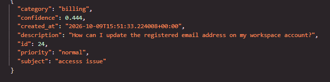

## task 2933

| Title | Steps to reproduce | Expected | Actual | Severity (high, medium, low) | Evidence | Owner |
| --- | --- | --- | --- | --- | --- | --- |
|Email-update request classified as billing instead of access|1.check commit (880adfa49912bb0e213c11f63ddbf73cd7657cf4) 2.open ticket form 3.Enter subject "acess issue" and Enter description " How can I update the registered email address on my workspace account?" 4.click submit 5.Check the created ticket (Ticket #24) and observe the returned AI category in the API response and Dashboard|create ticket succefully with category "Access"|The form submitted successfully. In DevTools Network, POST /api/tickets returned status 201 OK with generated ID 24.commit retested (880adfa49912bb0e213c11f63ddbf73cd7657cf4) The AI categorized it as billing with 0.444 confidence and normal priority. After reloading the dashboard, ticket #24 remained visible with all data intact." Note: An earlier run of this test returned access at about 41% confidence, while the newer run returned billing at about 44%.|To be coordinated with Enzu / AI team||Enzu / AI Team|