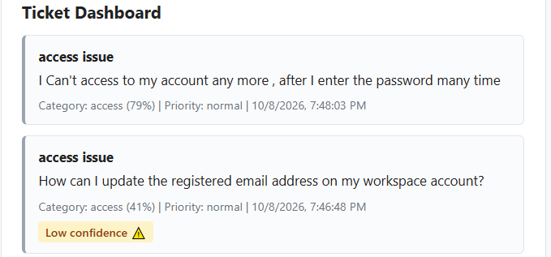
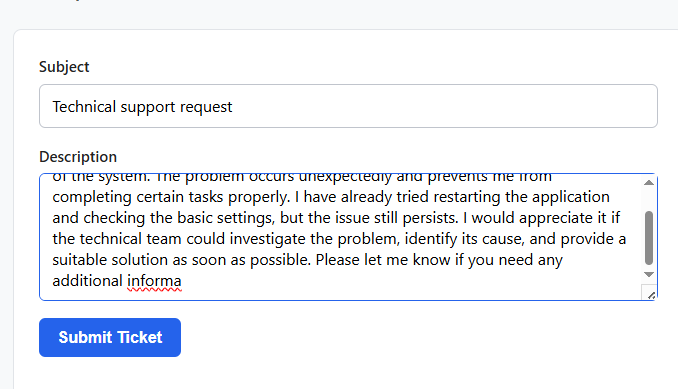
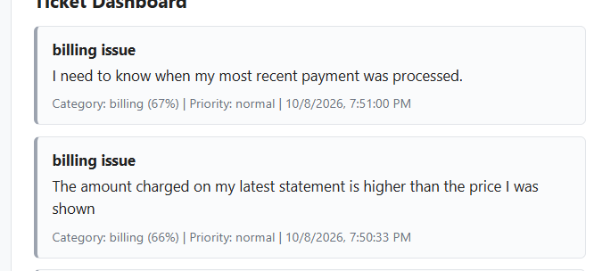

# SmartDesk test cases

| Test ID | Input | Steps | Expected result | Actual result | Pass/Fail | Evidence |
| TC-ValidAccess-001 |---|---|---|---|---|---|
| TC-ValidBilling-002 |---|---|---|---|---|---|
| TC-ValidTechnical-003 |---|---|---|---|---|---|
| TC-BlankSubject-004 |---|---|---|---|---|---|
| TC-BlankDescription-005 |---|---|---|---|---|---|
| TC-101CharacterSubject-006 |---|---|---|---|---|---|
| TC-501CharacterDescription-007 |---|---|---|---|---|---|
| TC-CharacterDescription-008 |---|---|---|---|---|---|
| TC-DuplicateTicket-009 |---|---|---|---|---|---|
| TC-HTMLLikeText-010 |---|---|---|---|---|---|
| TC-AmbiguousTicket-011 |---|---|---|---|---|---|

## Task 2934 - Unsafe and unusual input

| Test ID | Input | Steps | Expected result | Actual result | Pass/Fail | Evidence |
|---|---|---|---|---|---|---|
| TC-HTMLBold-001 | `{"subject":"HTML bold test","description":"<b>bold</b>"}` | 1. Enter HTML bold test as Subject. 2. Enter `<b>bold</b>` as Description. 3. Click Submit Ticket. 4. Check the Ticket Dashboard. 5. Reload the dashboard and check the ticket again. | Status Code: 201 — The exact text `<b>bold</b>` is displayed as plain text. It is not rendered as bold HTML. | Status Code: 201 Created. The ticket was successfully created. The dashboard displayed the exact text `<b>bold</b>` as plain text and did not render it as bold HTML. After reloading the dashboard, the exact text remained literal. | PASS |  |
| TC-Script-002 | `{"subject":"Script test","description":""}` | 1. Enter Script test as Subject. 2. Enter `` as Description. 3. Click Submit Ticket. 4. Check the Ticket Dashboard. 5. Reload the dashboard and check the ticket again. | Status Code: 201 — The exact script text is displayed as plain text. No JavaScript executes and no alert popup appears. | Status Code: 201 Created. The ticket was successfully created. The response stored the exact text ``. The script was displayed as text and no JavaScript alert was observed. After reloading the dashboard, the exact text remained literal and no alert appeared. | PASS |  |
| TC-Image-003 | `{"subject":"Image test","description":""}` | 1. Enter Image test as Subject. 2. Enter `` as Description. 3. Click Submit Ticket. 4. Check the Ticket Dashboard. 5. Reload the dashboard and check the ticket again. | Status Code: 201 — The exact text `` is displayed as plain text. No image is rendered. | Status Code: 201 Created. The ticket was successfully created. The response stored the exact text ``, and no image was rendered on the dashboard. After reloading the dashboard, the exact text remained literal and no image was rendered. | PASS |  |
| TC-Spaces-004 | `{"subject":"Spaces test","description":" "}` | 1. Enter Spaces test as Subject. 2. Enter only spaces in Description. 3. Click Submit Ticket. 4. Verify the browser validation behavior in DevTools Network. 5. Send the same JSON through Postman to the API. | The spaces-only input is rejected. If browser validation prevents submission, no POST request is sent. The same JSON sent through the API should return an appropriate 400 response. | Browser validation blocked submission; no POST sent. Separately, the same JSON sent through Postman returned Status Code: 400 Bad Request with the response: `"Description is required (max 500 characters)"`. | PASS |  |

## Task 2933

| Test ID | Input | Steps | Expected result | Actual result | Pass/Fail | Evidence |

| TC-ValidAccessCheckedOnPage-01|{
    "subject" :"acess issue",
"description":"I Can't access to my account any more , after I enter the password many time"
}|1. go to tickets form 2. Enter your subject and description 3. click submit|create ticket ssuccessfully with the correct category "access"|create ticket ssuccessfully with the correct category "access"|pass||

| TC-ValidAccessCheckedOnPage-02|{
    "subject" :"acess issue",
"description":"How can I update the registered email address on my workspace account?"
}|1. go to tickets form 2. Enter your subject and description 3. click submit|create ticket ssuccessfully with the correct category "access"|create ticket ssuccessfully with the correct category "access"|pass||

|TC-501CharacterDescription-03|{
    "subject" :"Technical support request",
"description":"I am currently experiencing a technical issue that is affecting the normal operation of the system. The problem occurs unexpectedly and prevents me from completing certain tasks properly. I have already tried restarting the application and checking the basic settings, but the issue still persists. I would appreciate it if the technical team could investigate the problem, identify its cause, and provide a suitable solution as soon as possible. Please let me know if you need any additional information, screenshots, error messages, or steps to reproduce the issue."
}|massege or alert that description must be 500 max lingth |1. go to tickets form 2. Enter your subject and description 501 charcter|nothing happend | fail ||

|TC-ValidbiilingCheckedOnPage-04|{"subject" :"billing support request",
"description":"The amount charged on my latest statement is higher than the price I was shown"
}|1. go to tickets form 2. Enter your subject and description 3. click submit|create ticket ssuccessfully with the correct category "biling"|create ticket ssuccessfully with the correct category "biling"|pass||

|TC-ValidbiilingCheckedOnPage-05|{"subject" :"billing support request",
"description":"The amount charged on my latest statement is higher than the price I was shown"
}|1. go to tickets form 2. Enter your subject and description 3. click submit|create ticket ssuccessfully with the correct category "biling"|create ticket ssuccessfully with the correct category "biling"|pass|
|