# SmartDesk Test Cases

| Test ID | Input | Steps | Expected result | Actual result | Pass/Fail | Evidence |
| --- | --- | --- | --- | --- | --- | --- |
| TC-ValidAccess-001 | `{"subject":"Unable to access my account","description":"I cannot log into my account"}` | 1. Enter the subject. 2. Enter the description. 3. Submit the ticket. | `201 -> {"id","same subject","same description","category (access, billing or technical)","confidence between 0 and 1","priority","created_at"}` | `201 -> {"id": 27, "subject": "Unable to access my account", "description": "I cannot log into my account", "category": "technical", "confidence": 0.5, "priority": "normal", "created_at": "2026-10-08T15:48:59.417316+00:00"}` | Pass |  |
| TC-ValidBilling-002 | `{"subject":"Billing inquiry regarding invoice #12345","description":"I would like to request an itemized breakdown for my latest invoice."}` | 1. Open billing form. 2. Enter valid subject. 3. Enter valid description. 4. Submit ticket. | `201 -> {"id","same subject","same description","category (access, billing or technical)","confidence between 0 and 1","priority","created_at"}` | `201 -> {"id": 28, "subject": "Billing inquiry regarding invoice #12345", "description": "I would like to request an itemized breakdown for my latest invoice.", "category": "technical", "confidence": 0.5, "priority": "normal", "created_at": "2026-10-08T15:49:35.313693+00:00"}` | Pass |  |
| TC-ValidTechnical-003 | `{"subject":"PDF upload failed","description":"The app freezes when I upload a PDF"}` | 1. Navigate to support portal. 2. Enter subject and description. 3. Click Submit. | `201 -> {"id","same subject","same description","technical","confidence","priority","created_at"}` | `201 -> {"id": 29, "subject": "PDF upload failed", "description": "The app freezes when I upload a PDF", "category": "technical", "confidence": 0.5, "priority": "normal", "created_at": "2026-10-08T15:50:43.445570+00:00"}` | Pass |  |
| TC-BlankSubject-004 | `{"subject":"","description":"Need help with my account settings"}` | 1. Navigate to support portal. 2. Leave Subject blank. 3. Click Submit. | `400 -> {"error":"Subject is required (max 100 characters)"}` | `400 -> {"error": "Subject is required (max 100 characters)"}` | Pass |  |
| TC-BlankDescription-005 | `{"subject":"Need help with my account settings","description":""}` | 1. Navigate to support portal. 2. Leave description blank. 3. Click Submit. | `400 -> {"error":"Description is required (max 500 characters)"}` | `400 -> {"error": "Description is required (max 500 characters)"}` | Pass |  |
| TC-101CharacterSubject-006 | subject is 101 x characters, description is "I need help logging in" | 1. Open ticket form. 2. Enter a subject longer than 100 characters. 3. Enter a valid description. 4. Submit ticket. | `400 -> {"error":"Subject is required (max 100 characters)"}` | `400 -> {"error": "Subject is required (max 100 characters)"}` | Pass |  |
| TC-501CharacterDescription-007 | subject "Technical support request", description is 501 y characters | 1. Open ticket form. 2. Enter valid subject. 3. Enter a description longer than 500 characters. 4. Submit ticket. | `400 -> {"error":"Description is required (max 500 characters)"}` | `400 -> {"error": "Description is required (max 500 characters)"}` | Pass |  |
| TC-DuplicateTicket-008 | `{"subject":"Unable to access my account","description":"I cannot log into my account using my correct credentials."}` | 1. Submit the ticket with the specified subject and description. 2. Submit the same ticket again with the identical subject and description. 3. Check the response for the second submission. | `201 for both submissions, and the second ticket has a different id` | `201 -> {"id": 30, "subject": "Unable to access my account", "description": "I cannot log into my account using my correct credentials.", "category": "technical", "confidence": 0.5, "priority": "normal", "created_at": "2026-10-08T16:01:41.019813+00:00"}` | Pass |  |
| TC-HTMLLikeText-009 | `{"subject":"<b>Login Problem</b>","description":"I cannot login to my account. <b>Please help.</b>"}` | 1. Navigate to support portal. 2. Enter HTML-like text in Subject and Description. 3. Click Submit. 4. Check the response/UI. | `201 -> {"id","same subject as plain text not html","same description as plain text not html","category","confidence","priority","created_at"}` | `201 -> {"id": 31, "subject": "<b>Login Problem</b>", "description": "I cannot login to my account. <b>Please help.</b>", "category": "technical", "confidence": 0.5, "priority": "normal", "created_at": "2026-10-08T16:02:08.094161+00:00"}` | Pass |  |
| TC-AmbiguousTicket-010 | `{"subject":"Help needed","description":"i need help"}` | 1. Navigate to support portal. 2. Enter some text that couldn't be classified as one of the three categories. 3. Click Submit. 4. Check the response/UI. | `201 -> {"id","same subject as plain text not html","same description as plain text not html","one valid category","confidence between 0 and 1","priority","created_at"}` | `201 -> {"id": 32, "subject": "Help needed", "description": "i need help", "category": "technical", "confidence": 0.5, "priority": "normal", "created_at": "2026-10-08T16:02:33.623465+00:00"}` | Pass |  |
| TC-MalformedJson-011 | `{"subject":"Help needed","description":}` | --- | `400 -> {  "error": "Request body must be a JSON object"}` | `400 -> {"error": "Request body must be a JSON object"}` | Pass |  |
| TC-Priority-012 | `{"subject":"Login broken","description":"I cannot access my account"}` | 1. Open the page. 2. Type the subject and description. 3. Click Submit. 4. Read the priority on the new card. | `201 -> priority urgent` | `201 -> {"id": 33, "priority": "urgent", "category": "access", "confidence": 0.737}` | Pass | 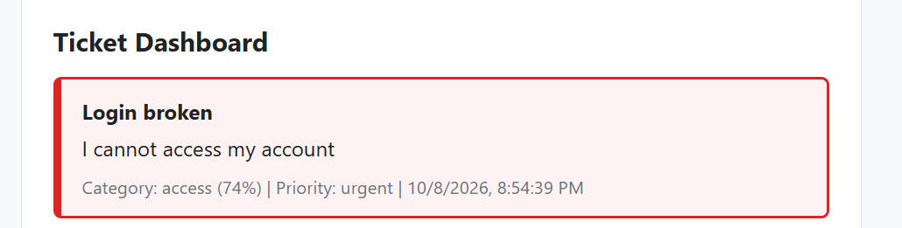 |
| TC-Priority-013 | `{"subject":"Server DOWN","description":"Site unreachable"}` | 1. Open the page. 2. Type the subject and description. 3. Click Submit. 4. Read the priority on the new card. | `201 -> priority urgent (capital letters)` | `201 -> {"id": 34, "priority": "urgent", "category": "technical", "confidence": 0.477}` | Pass | 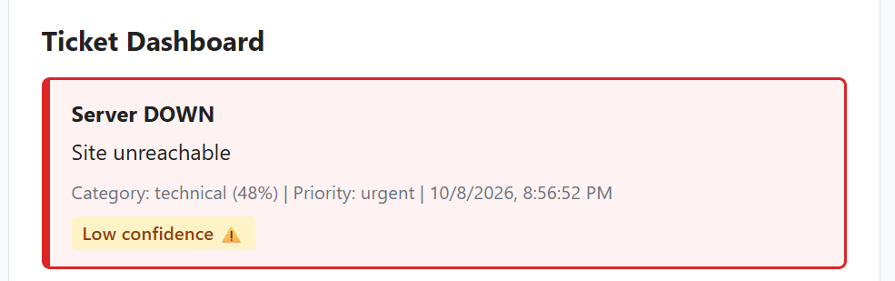 |
| TC-Priority-014 | `{"subject":"Download fails","description":"The download button gives an error"}` | 1. Open the page. 2. Type the subject and description. 3. Click Submit. 4. Read the priority on the new card. | `201 -> priority normal (download is not the word down)` | `201 -> {"id": 35, "priority": "normal", "category": "technical", "confidence": 0.778}` | Pass | 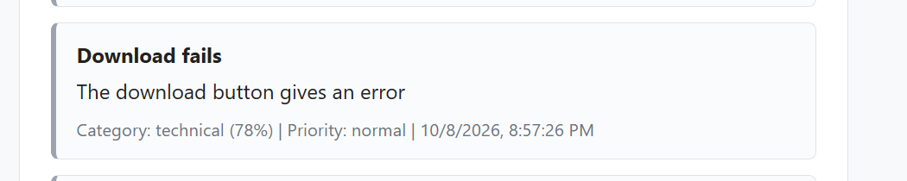 |
| TC-Priority-015 | `{"subject":"Printer issue","description":"Paper jam on floor 2"}` | 1. Open the page. 2. Type the subject and description. 3. Click Submit. 4. Read the priority on the new card. | `201 -> priority normal` | `201 -> {"id": 36, "priority": "normal", "category": "billing", "confidence": 0.445}` | Pass | 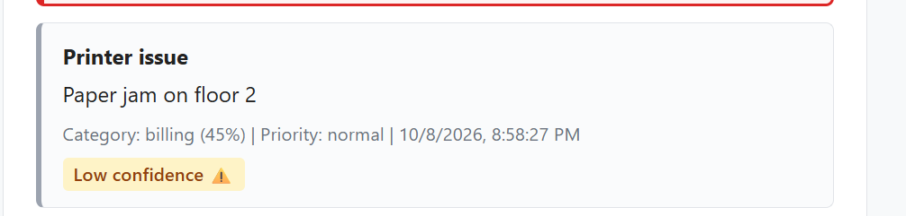 |
| TC-Priority-016 | `{"subject":"Outage","description":"Please help"}` | 1. Open the page. 2. Type the subject and description. 3. Click Submit. 4. Read the priority on the new card. | `201 -> priority urgent (phrase in subject only)` | `201 -> {"id": 37, "priority": "urgent", "category": "access", "confidence": 0.481}` | Pass | 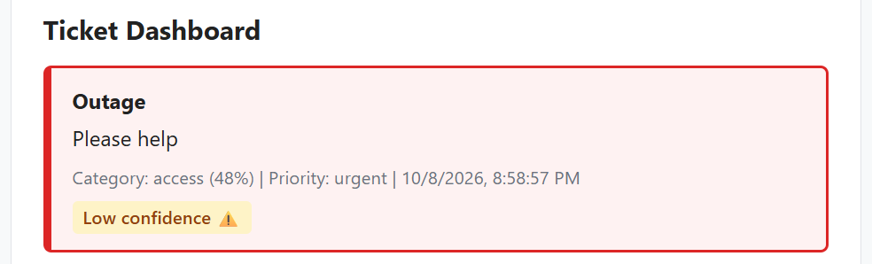 |
| TC-Priority-017 | `{"subject":"Report problem","description":"We had data loss after saving"}` | 1. Open the page. 2. Type the subject and description. 3. Click Submit. 4. Read the priority on the new card. | `201 -> priority urgent (phrase in description only)` | `201 -> {"id": 38, "priority": "urgent", "category": "technical", "confidence": 0.491}` | Pass | 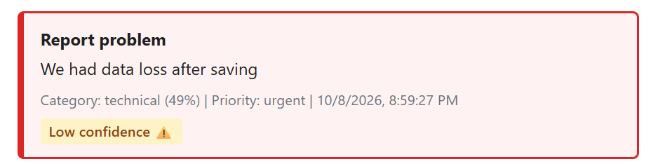 |
| TC-Priority-018 | `{"subject":"Password reset","description":"I am locked out since this morning"}` | 1. Open the page. 2. Type the subject and description. 3. Click Submit. 4. Read the priority on the new card. | `201 -> priority urgent` | `201 -> {"id": 39, "priority": "urgent", "category": "access", "confidence": 0.619}` | Pass | 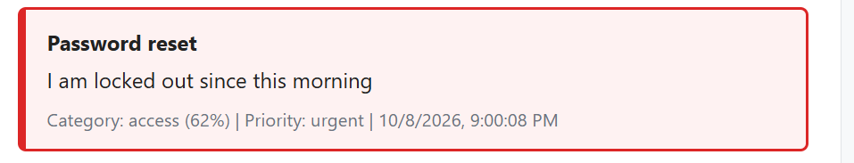 |
| TC-Priority-019 | `{"subject":"Slow laptop","description":"Everything is slow after the breakdown of my laptop"}` | 1. Open the page. 2. Type the subject and description. 3. Click Submit. 4. Read the priority on the new card. | `201 -> priority normal (breakdown is not the word down)` | `201 -> {"id": 40, "priority": "normal", "category": "access", "confidence": 0.528}` | Pass | 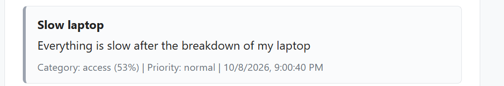 |
| TC-Priority-020 | `{"subject":"Cannot log in","description":"I can't access my account"}` | 1. Open the page. 2. Type the subject and description. 3. Click Submit. 4. Read the priority on the new card. | `201 -> priority normal (the rule only matches the words cannot access)` | `201 -> {"id": 41, "priority": "normal", "category": "access", "confidence": 0.813}` | Pass | 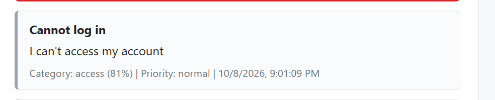 |
| TC-Priority-021 | Submit TC-Priority-013 (urgent) first, then TC-Priority-015 (normal), then reload the page and send GET /api/tickets | 1. Submit the urgent ticket. 2. Submit the normal ticket afterwards. 3. Reload the dashboard and send GET /api/tickets. 4. Compare the positions of the two tickets. | `The older urgent ticket appears above the newer normal ticket` | `201 -> urgent ticket created with id 54, priority urgent. 201 -> normal ticket created with id 55, priority normal. 200 -> GET /api/tickets returns 55 cards; the urgent card id 54 is at position 0 and the normal card id 55 is at position 15, so the older urgent ticket is above the newer normal one` | Pass | 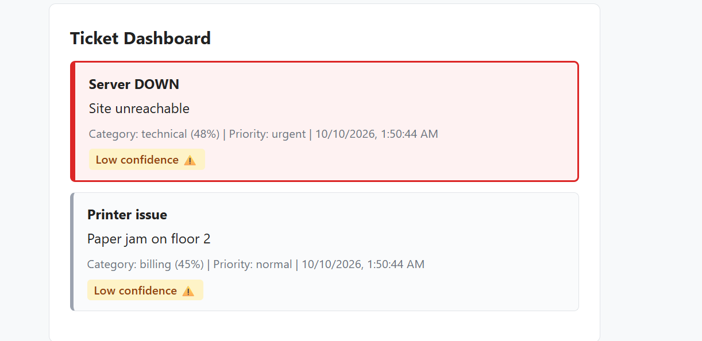 |

Historical note on the API rows above: the Actual results for TC-ValidAccess-001, TC-ValidBilling-002 and
TC-ValidTechnical-003 were recorded against the temporary stub predictor, which always returned
technical with confidence 0.5. They are kept as the historical record for task 2915. They are not
evidence about the trained model. Re-run those checks in #36 against current main before treating the
category as verified.

Model quality is tracked separately from priority. These 13 cases only check the priority rule, so a
weak or wrong category prediction does not fail them. For example TC-Priority-015 has priority normal,
which is correct, even though the model predicted the category billing for a printer problem.

| TC-Priority-022 | `{"subject":"Login issue","description":"This affects all users"}` | 1. Open the page. 2. Type the subject and description. 3. Click Submit. 4. Read the priority on the new card. | `201 -> priority urgent (phrase in description only)` | `201 -> {"id": 56, "priority": "urgent", "category": "access", "confidence": 0.378}` | Pass | 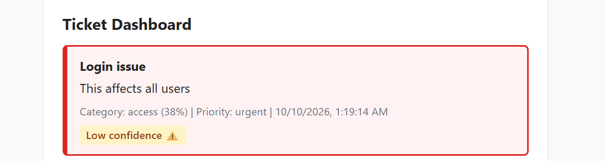 |
| TC-Priority-023 | `{"subject":"Login issue","description":"Everyone is affected"}` | 1. Open the page. 2. Type the subject and description. 3. Click Submit. 4. Read the priority on the new card. | `201 -> priority urgent (phrase in description only)` | `201 -> {"id": 57, "priority": "urgent", "category": "access", "confidence": 0.429}` | Pass | 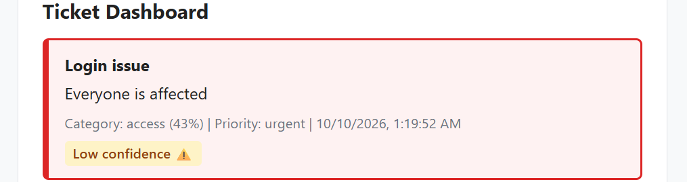 |
| TC-Priority-024 | `{"subject":"Production issue","description":"Please investigate"}` | 1. Open the page. 2. Type the subject and description. 3. Click Submit. 4. Read the priority on the new card. | `201 -> priority urgent (phrase in subject only)` | `201 -> {"id": 58, "priority": "urgent", "category": "billing", "confidence": 0.493}` | Pass | 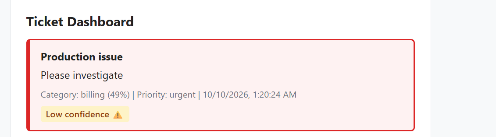 |

## Task 2934 - Unsafe and unusual input

| Test ID | Input | Steps | Expected result | Actual result | Pass/Fail | Evidence |
|---|---|---|---|---|---|---|
| TC-HTMLBold-001 | `{"subject":"HTML bold test","description":"<b>bold</b>"}` | 1. Enter HTML bold test as Subject. 2. Enter `<b>bold</b>` as Description. 3. Click Submit Ticket. 4. Check the Ticket Dashboard. 5. Reload the dashboard and check the ticket again. | Status Code: 201 — The exact text `<b>bold</b>` is displayed as plain text. It is not rendered as bold HTML. | Status Code: 201 Created. The ticket was successfully created. The dashboard displayed the exact text `<b>bold</b>` as plain text and did not render it as bold HTML. After reloading the dashboard, the exact text remained literal. | PASS |  |
| TC-Script-002 | `{"subject":"Script test","description":""}` | 1. Enter Script test as Subject. 2. Enter `` as Description. 3. Click Submit Ticket. 4. Check the Ticket Dashboard. 5. Reload the dashboard and check the ticket again. | Status Code: 201 — The exact script text is displayed as plain text. No JavaScript executes and no alert popup appears. | Status Code: 201 Created. The ticket was successfully created. The response stored the exact text ``. The script was displayed as text and no JavaScript alert was observed. After reloading the dashboard, the exact text remained literal and no alert appeared. | PASS |  |
| TC-Image-003 | `{"subject":"Image test","description":""}` | 1. Enter Image test as Subject. 2. Enter `` as Description. 3. Click Submit Ticket. 4. Check the Ticket Dashboard. 5. Reload the dashboard and check the ticket again. | Status Code: 201 — The exact text `` is displayed as plain text. No image is rendered. | Status Code: 201 Created. The ticket was successfully created. The response stored the exact text ``, and no image was rendered on the dashboard. After reloading the dashboard, the exact text remained literal and no image was rendered. | PASS |  |
| TC-Spaces-004 | `{"subject":"Spaces test","description":" "}` | 1. Enter Spaces test as Subject. 2. Enter only spaces in Description. 3. Click Submit Ticket. 4. Verify the browser validation behavior in DevTools Network. 5. Send the same JSON through Postman to the API. | The spaces-only input is rejected. If browser validation prevents submission, no POST request is sent. The same JSON sent through the API should return an appropriate 400 response. | Browser validation blocked submission; no POST sent. Separately, the same JSON sent through Postman returned Status Code: 400 Bad Request with the response: `"Description is required (max 500 characters)"`. | PASS |  |
