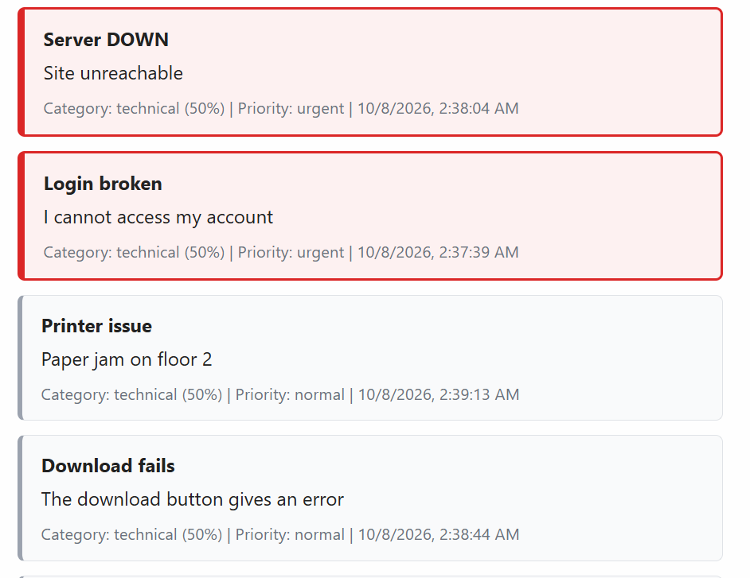

# SmartDesk Test Cases

| Test ID | Input | Steps | Expected result | Actual result | Pass/Fail | Evidence |
| --- | --- | --- | --- | --- | --- | --- |
| TC-ValidAccess-001 | `{"subject":"Unable to access my account","description":"I cannot log into my account"}` | 1. Enter the subject. 2. Enter the description. 3. Submit the ticket. | `201 -> {"id","same subject","same description","category (access, billing or technical)","confidence between 0 and 1","priority","created_at"}` | `201 -> {"id": 27, "subject": "Unable to access my account", "description": "I cannot log into my account", "category": "technical", "confidence": 0.5, "priority": "normal", "created_at": "2026-10-08T15:48:59.417316+00:00"}` | Pass |  |
| TC-ValidBilling-002 | `{"subject":"Billing inquiry regarding invoice #12345","description":"I would like to request an itemized breakdown for my latest invoice."}` | 1. Open billing form. 2. Enter valid subject. 3. Enter valid description. 4. Submit ticket. | `201 -> {"id","same subject","same description","category (access, billing or technical)","confidence between 0 and 1","priority","created_at"}` | `201 -> {"id": 28, "subject": "Billing inquiry regarding invoice #12345", "description": "I would like to request an itemized breakdown for my latest invoice.", "category": "technical", "confidence": 0.5, "priority": "normal", "created_at": "2026-10-08T15:49:35.313693+00:00"}` | Pass |  |
| TC-ValidTechnical-003 | `{"subject":"PDF upload failed","description":"The app freezes when I upload a PDF"}` | 1. Navigate to support portal. 2. Enter subject and description. 3. Click Submit. | `201 -> {"id","same subject","same description","technical","confidence","priority","created_at"}` | `201 -> {"id": 29, "subject": "PDF upload failed", "description": "The app freezes when I upload a PDF", "category": "technical", "confidence": 0.5, "priority": "normal", "created_at": "2026-10-08T15:50:43.445570+00:00"}` | Pass |  |
| TC-BlankSubject-004 | `{"subject":"","description":"Need help with my account settings"}` | 1. Navigate to support portal. 2. Leave Subject blank. 3. Click Submit. | `400 -> {"error":"Subject is required (max 100 characters)"}` | `400 -> {"error": "Subject is required (max 100 characters)"}` | Pass |  |
| TC-BlankDescription-005 | `{"subject":"Need help with my account settings","description":""}` | 1. Navigate to support portal. 2. Leave description blank. 3. Click Submit. | `400 -> {"error":"Description is required (max 500 characters)"}` | `400 -> {"error": "Description is required (max 500 characters)"}` | Pass |  |
| TC-101CharacterSubject-006 | subject is 101 x characters, description is "I need help logging in" | 1. Open ticket form. 2. Enter a subject longer than 100 characters. 3. Enter a valid description. 4. Submit ticket. | `400 -> {"error":"Subject is required (max 100 characters)"}` | `400 -> {"error": "Subject is required (max 100 characters)"}` | Pass |  |
| TC-501CharacterDescription-007 | subject "Technical support request", description is 501 y characters | 1. Open ticket form. 2. Enter valid subject. 3. Enter a description longer than 500 characters. 4. Submit ticket. | `400 -> {"error":"Description is required (max 500 characters)"}` | `400 -> {"error": "Description is required (max 500 characters)"}` | Pass |  |
| TC-DuplicateTicket-008 | `{"subject":"Unable to access my account","description":"I cannot log into my account using my correct credentials."}` | 1. Submit the ticket with the specified subject and description. 2. Submit the same ticket again with the identical subject and description. 3. Check the response for the second submission. | `201 for both submissions, and the second ticket has a different id` | `201 -> {"id": 30, "subject": "Unable to access my account", "description": "I cannot log into my account using my correct credentials.", "category": "technical", "confidence": 0.5, "priority": "normal", "created_at": "2026-10-08T16:01:41.019813+00:00"}` | Pass |  |
| TC-HTMLLikeText-009 | `{"subject":"<b>Login Problem</b>","description":"I cannot login to my account. <b>Please help.</b>"}` | 1. Navigate to support portal. 2. Enter HTML-like text in Subject and Description. 3. Click Submit. 4. Check the response/UI. | `201 -> {"id","same subject as plain text not html","same description as plain text not html","category","confidence","priority","created_at"}` | `201 -> {"id": 31, "subject": "<b>Login Problem</b>", "description": "I cannot login to my account. <b>Please help.</b>", "category": "technical", "confidence": 0.5, "priority": "normal", "created_at": "2026-10-08T16:02:08.094161+00:00"}` | Pass |  |
| TC-AmbiguousTicket-010 | `{"subject":"Help needed","description":"i need help"}` | 1. Navigate to support portal. 2. Enter some text that couldn't be classified as one of the three categories. 3. Click Submit. 4. Check the response/UI. | `201 -> {"id","same subject as plain text not html","same description as plain text not html","one valid category","confidence between 0 and 1","priority","created_at"}` | `201 -> {"id": 32, "subject": "Help needed", "description": "i need help", "category": "technical", "confidence": 0.5, "priority": "normal", "created_at": "2026-10-08T16:02:33.623465+00:00"}` | Pass |  |
| TC-MalformedJson-011 | `{"subject":"Help needed","description":}` | --- | `400 -> {  "error": "Request body must be a JSON object"}` | `400 -> {"error": "Request body must be a JSON object"}` | Pass |  |
| TC-Priority-012 | `{"subject":"Login broken","description": "I cannot access my account "}` | 1. Enter the subject. 2. Enter the description. 3. Submit the ticket. | `urgent` | `urgent` | Pass |  |
| TC-Priority-013 | `{"subject":"Server DOWN","description": "Site unreachable"}` | 1. Enter the subject. 2. Enter the description. 3. Submit the ticket. | `urgent` | `urgent` | Pass |  |
| TC-Priority-014 | `{"subject":"Download fails","description": "The download button gives an error"}` | 1. Enter the subject. 2. Enter the description. 3. Submit the ticket. | `normal` | `normal` | Pass |  |
| TC-Priority-015 | `{"subject":"Printer issue","description": "Paper jam on floor 2"}` | 1. Enter the subject. 2. Enter the description. 3. Submit the ticket. | `normal` | `normal` | Pass |  |

TC-001 and TC-002: the category check is blocked until the A2 model replaces the stub (it always returns technical with confidence 0.5).